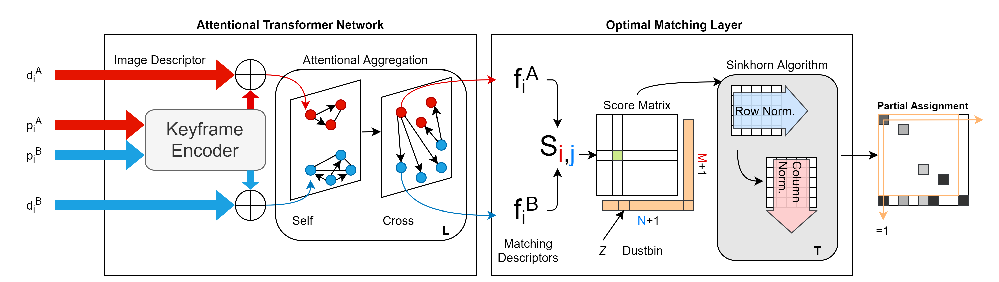
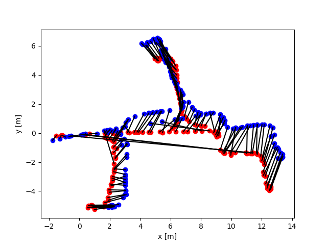
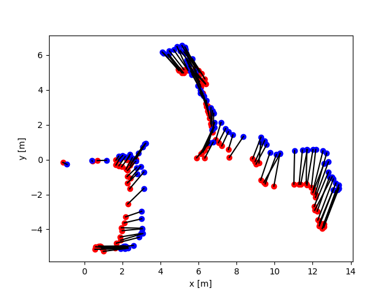
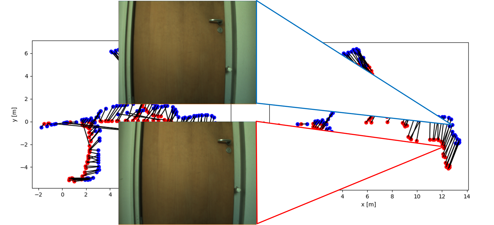
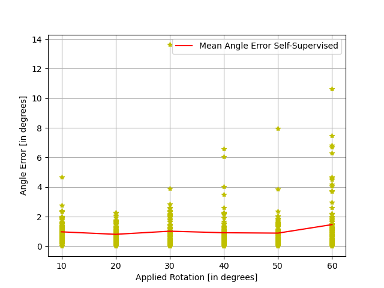
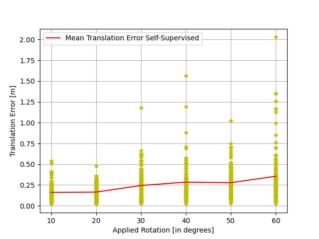
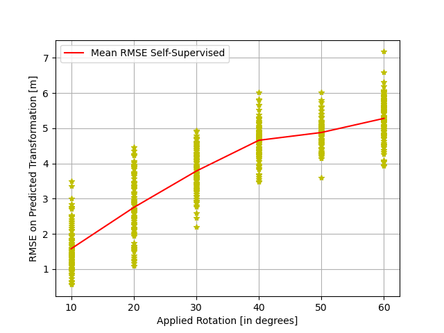

# Pose-Graph

## Abstract

Simultaneous Localization and Mapping (SLAM) is used to develop a map and localize the agents in that map. In this setup, multiple agents creating their own maps have different coordinate frames, chosen arbitrarily. The absolute localization aims at localizing multiple agents in the common shared map. This thesis aims at performing absolute localization by means of registering the cameras poses, represented in the form of pose graphs within the framework of SLAM. To register the pose graph, we perform a direct matching between pose graphs. For such a matching problem, we use image features of the keyframes to recover the corresponding pose. The goal of this work is to match pose graphs using image features and in turn find the relation between their coordinate systems. This allows us to align multiple pose graphs for absolute localization. The proposed method extracts keyframes’ features and uses the attention propagation in transformer networks for finding soft assignment of matching. Our experiments demonstrate a very encouraging effectiveness of the proposed method.

## Dataset

The [COLD](https://www.coldb.org/site/metadata/) dataset was used. The Freiburg sequence within the dataset was considered. The Freiburg part itself is divided into 3 sequences and each one of them is captured in different weather conditions possible like cloudy, sunny and night. These sequences are used for training, validation and test. 

## Model

The `model/superglue.py` file contains the model and loss function including RANSAC. The model architecture is as shown.

  

## Training and Testing

The sequences are sub-sampled to 512 keyframes before feeding to the network. Two pose graphs A and B sub-sampled from different weather conditions are used. Since the COLD dataset has absolute 2D localization of all sequences, we need to generate a rigid transformation of one pose graph before matching with the other. This is done by randomly rotating by an angle &Theta;applied (in x-y plane) and translating tapplied = [txapplied ; tyapplied] (again in x-y plane) the pose graph by a random distance. In 2D localization, two pose graphs need matching when their coordinate axes are not aligned. The rotation and translation in 2D space are introduced to achieve this misalignment.

We exploit the absolute localization of the COLD dataset to generate keyframe matches M for self-supervised training. The matches M between two pose graphs A and B are computed as a M *X* N pairwise distance matrix with distances greater than 0.2 meter and angles greater than 10 degrees considered as unmatched keyframes. This threshold value is selected considering the indoor environment of COLD Freiburg dataset. Furthermore after thresholding, a one to one matching between graphs A and B, following the minimum distance, is performed.

The `train.py` file trains on Sequence 1 of Frieburg COLD dataset. The `load_data.py` file controls this data loading behaviour.

The `test.py` runs over 100 test sub-sequences from Sequence 3 of Freiburg and saves the results in an npy file.

## Results

As a post-processing step, RANSAC is applied on the rigid transformation to filter out the mis-matched keyframes by the network. The network output and the RANSAC filtered results are shown below for the test case. As it can be seen there are a lot of mis-matches by the network and hence post-processing is essential.

  
  
  

The performance of the network for different angles of rigid transformation between the pose graphs is summarized in the table and following figures. On a general note it can be seen that the error values increase with larger rigid transformations(Applied Rotation).

| Evaluation Metric      | Applied Rotation            |
|                        | 10 | 20 | 30 | 40 | 50 | 60 |
| ----------- | ----------- | ----------- | ----------- | ----------- | ----------- |
| RMSE(tapplied)      | 1.588     | 2.755 | 3.793 | 4.656 | 4.873 | 5.270 |
| Paragraph   | Text        |
| Header      | Title       |
| Paragraph   | Text        |

| Evaluation Metric | <td colspan=3>Applied Angle |                                                             
| -- | -- | -- | -- |                                                                                                   
| RMSE | 1 | 2 | 3 |                                                                   

  
  
  
  

